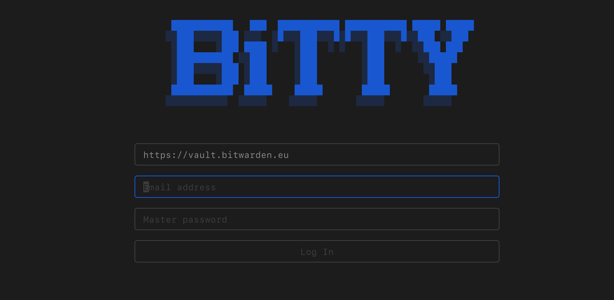
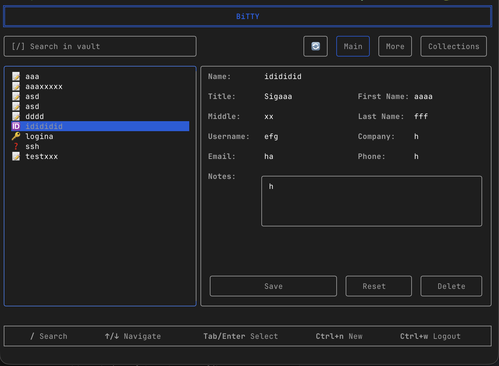

# BiTTY - Bitwarden TUI & CLI

## Install

```bash
npm install -g bitty-tui
```

Run with:

```bash
bitty
```

## Description

Bitwarden compatible TUI for your terminal, usable also as a scriptable CLI.




Works also with Vaultwarden.

If you check "Remember me" during login, your vault encryption keys are stored securely in your OS credential manager (Keychain on macOS, Credential Manager on Windows, Secret Service/libsecret on Linux) via [@napi-rs/keyring](https://github.com/Brooooooklyn/keyring-node).

## CLI

Running `bitty` with no arguments opens the interactive TUI. Any other argument runs bitty as a CLI command instead, printing to stdout and exiting with a status code — handy for scripts.

```bash
bitty <command> [options]
```

### Session

The CLI reuses the same session as the TUI (stored in your OS credential manager, with only the server URL hint kept in `~/.config/bitty/config.json`), so if you already logged in from the TUI with "Remember me" enabled, CLI commands work right away with no extra login step.

```bash
bitty login --remember-me   # log in once, persist the session for the CLI (and the TUI)
bitty login                 # log in for this invocation only, without persisting anything
bitty logout                # clear the saved session
```

`login` always asks for the master password interactively (it is never accepted as a command-line argument). `--server-url` and `--email` can be passed as flags to skip those prompts, and `--totp <code>` supplies a two-factor code up front without an extra prompt.

If no session is saved, any command that needs the vault will prompt you to log in on the spot — unless `--no-interactive` is passed, in which case it fails immediately instead of blocking on input (useful for scripts/cron):

```bash
bitty get github --no-interactive
# error: not logged in. Run `bitty login --remember-me` first.
```

### Reading the vault

```bash
bitty get <name> [--field password|username|totp|uri|notes] [--id <id>] [--folder <id>] [--json]
bitty ls [--search <query>] [--type login|note|card|identity|sshkey] [--org <id|name>] [--folder <id>] [--json]
bitty sync
bitty collections [--org <id|name>] [--json]
```

`bitty get <name>` prints a single field to stdout (`password` by default). `--field totp` computes the current 6-digit code, the same as the TUI does — it never prints the raw TOTP secret. `--json` prints the full decrypted item instead, which is the only way to read Card/Identity/SSH key fields from the CLI.

If several items share the same name, you're prompted to pick one interactively; with `--no-interactive` the command instead fails and lists the matching ids so you can disambiguate with `--id`/`--folder`.

### Writing to the vault

```bash
bitty template <login|note|card|identity>          # print an empty JSON skeleton for the type
bitty create <login|note|card|identity> [--name] [--username] [--password] [--uri] [--totp] [--notes] [--org <id> --collection <id>...] [--json <file|->]
bitty edit <id> [--name] [--username] [--password] [--uri] [--totp] [--notes] [--json <file|->]
bitty delete <id> [--yes]
bitty share <id> --org <id> --collection <id> [--collection <id>...]
```

The `--name`/`--username`/`--password`/`--uri`/`--totp`/`--notes` flags cover the common Login fields. For anything else (Card, Identity, or multiple fields at once) pass `--json` with a file path or `-` for stdin:

```bash
bitty template card > card.json
vim card.json
bitty create card --json card.json

echo '{"card":{"code":"999"}}' | bitty edit <id> --json -
```

`bitty delete` asks for confirmation unless `--yes` is passed (and refuses to delete without `--yes` when `--no-interactive` is set).

## Custom keybindings

Click the **⚙** button in the toolbar, or press `Ctrl+K`, to open the keybindings editor. Use `↑`/`↓` to select an action, `Enter` to capture a new key combination, and `Esc` to close.

Overrides are saved to `~/.config/bitty/keybinds.json` and merged with the defaults on startup. Delete the file (or use "Reset to defaults" inside the editor) to go back to the defaults.


## Acknowledgments
- [Bitwarden whitepaper](https://bitwarden.com/help/bitwarden-security-white-paper)
- [Bitwarden github](https://github.com/bitwarden)
- [BitwardenDecrypt](https://github.com/GurpreetKang/BitwardenDecrypt)

This project is not associated with [Bitwarden](https://github.com/bitwarden) or [Bitwarden, Inc.](https://bitwarden.com/)
