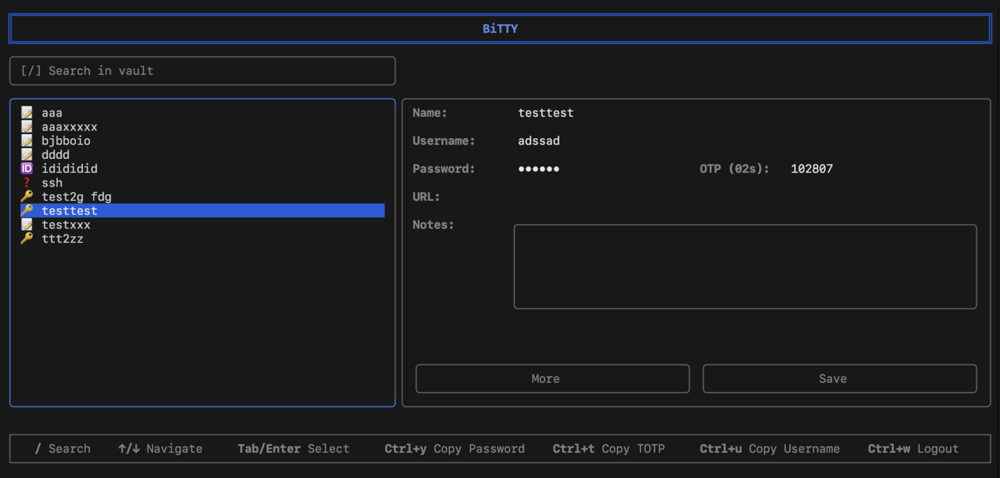

# BiTTY - Bitwarden TUI

## Install

```bash
$ npm install -g bitty-tui
```

## Description

Bitwarden compatible TUI for your terminal.




## Acknowledgments

- [Bitwarden](https://github.com/bitwarden)
- [BitwardenDecrypt](https://github.com/GurpreetKang/BitwardenDecrypt)

This project is not associated with [Bitwarden](https://github.com/bitwarden) or [Bitwarden, Inc.](https://bitwarden.com/)
