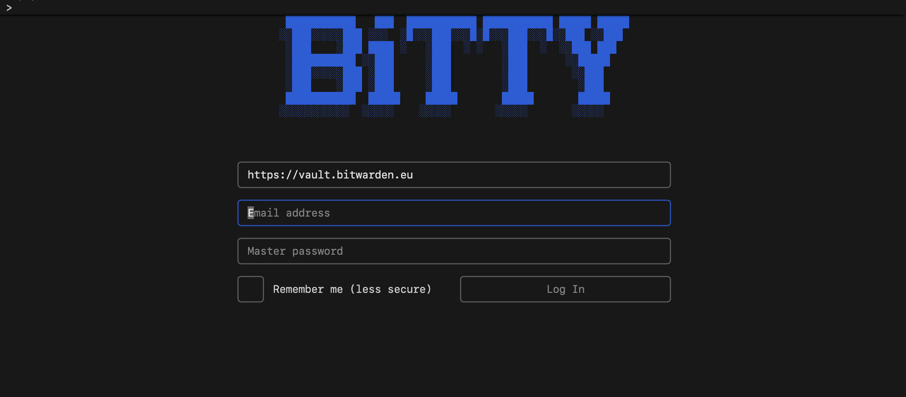

# BiTTY - Bitwarden TUI

## Install

```bash
npm install -g bitty-tui
```

Run with:

```bash
bitty
```

## Description

Bitwarden compatible TUI for your terminal.




Works also with Vaultwarden.

If you check "Remember me" during login, your vault encryption keys will be stored in plain text in your home folder (`$HOME/.config/bitty/config.json`). Use this option only if you are the only user of your machine.

## TODO

- Collections support
- Test Fido, Duo MFA support
- Handle more fields editing
- Handle creating different cipher types

## Acknowledgments

- [Bitwarden](https://github.com/bitwarden)
- [BitwardenDecrypt](https://github.com/GurpreetKang/BitwardenDecrypt)

This project is not associated with [Bitwarden](https://github.com/bitwarden) or [Bitwarden, Inc.](https://bitwarden.com/)
